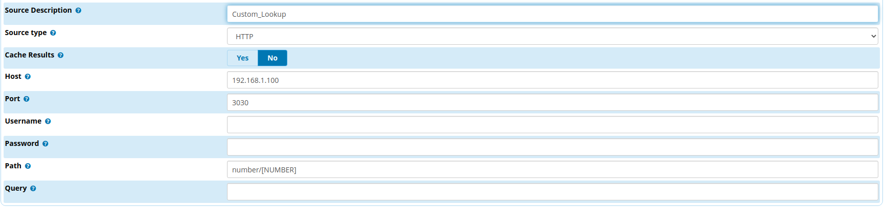

# FreePBX CID Lookup 
This is a simple python-flask server that a FreePBX telephony server can connect
to obtain the name of a caller.

## Features
- Connect to a MysqlDB to get the phones - *From some CRM let's say*
- Search at 11888.gr in case the number isn't locally present
- Greeklish conversion - *Some sip phones don't support greek characters*
- A minimal web interface
    - Most Frequent Callers
    - Call History
    - Indication of unregistered numbers
- Docker deployment with gunicorn server
   
> `DO NOT USE IT PUBLIC` 
>
> You are going to expose all your call history to the internet.
>
> Add some basic auth at least

## USAGE
1. Fist setup the FreePBX under the `Admin->CIDLookup`

2. Under `Connectivity->Inbound Routes` (TAB: `other`) set `CID Lookup Source`
3. Start the server (*Dont forget to set the Environment variables*)
4. Make a call!

## Development

```shell script
git clone ......phone_lookup
cd phone_lookup
```

> Make any changes you want 

### Database
You can change the code in `app/lookup.py->get_from_db()` to integrate with your setup.

Alternatively create the two views:

- account_phones
- contact_phones

with columns:

- name
- phone
     

### Docker 
> There isn't a docker hub image, you have to build it yourself

Set the Environment variables - *in docker-compose.yml*

Then build and start the server
```shell script
docker build -t phone_lookup:1.0.0 .
docker-compose up -d
```


## TODO
- Delete periodically
- An easy way to obtain unregistered numbers (csv perhaps)
- Enrich the web interface with
    - analytics,charts etc...
    - Datatables - *for pagination, search etc*
    - npm for js libraries
    - some bootstrap theme
    - Authentication - *Basic Auth should be enough*

> It's unlikely this app fits your needs exactly, so you should probably make 
> some changes (especially for the Database integration) 